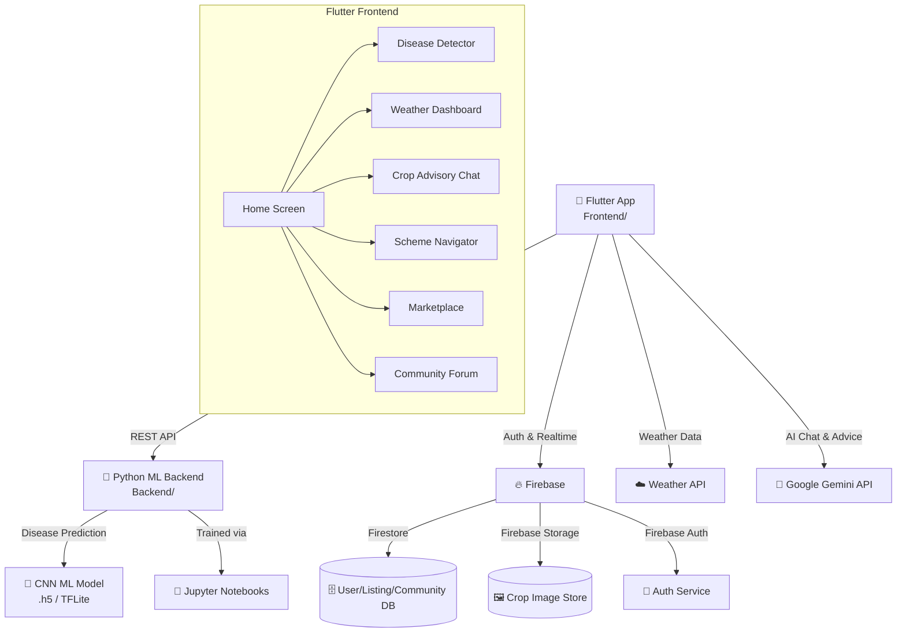
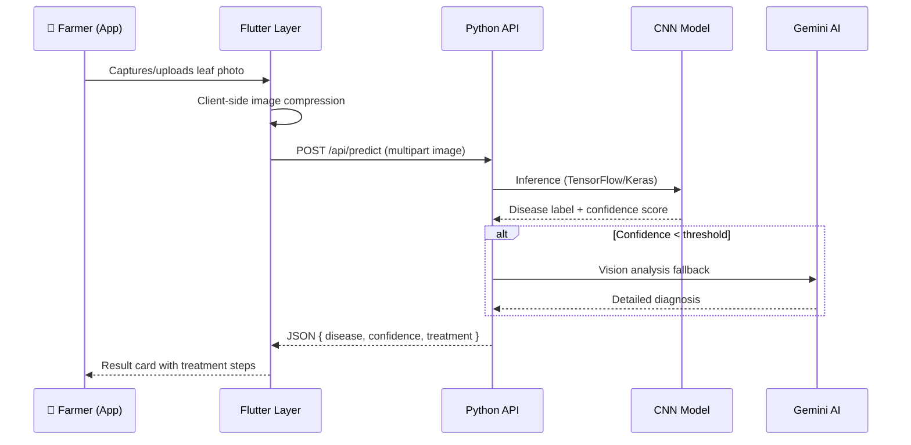
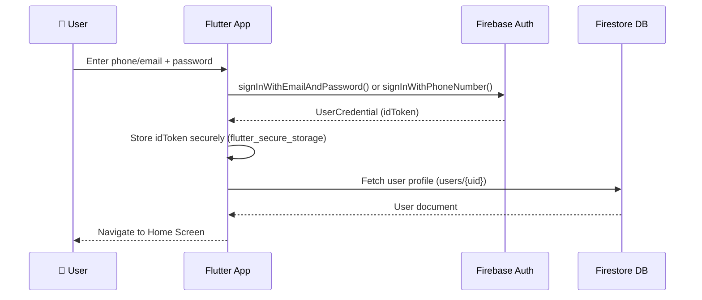

<div align="center">


# 🌾 KrishiMitra AI

### *Your Digital Friend in the Field*

**An AI-powered smart farming assistant for Indian farmers — delivering real-time weather insights, intelligent crop advice, government scheme discovery, automated disease detection, and a peer-to-peer marketplace, all from a single Flutter app.**

<br/>

[](https://flutter.dev)
[](https://dart.dev)
[](https://python.org)
[](LICENSE)
[](https://flutter.dev/multi-platform/mobile)
[](https://devfest5goa.devfolio.co/)

<br/>

[📖 Overview](#-overview) •
[✨ Features](#-features) •
[🛠 Tech Stack](#-tech-stack) •
[🏗 Architecture](#-architecture) •
[🚀 Quick Start](#-installation) •
[📡 API Reference](#-api-documentation) •
[🤝 Contributing](#-contributing)

</div>

---

## 📖 Overview

Over **140 million farmers** in India lack timely access to agricultural expertise, weather forecasts, market prices, and government welfare schemes. They face crop losses from undiagnosed diseases, price exploitation by middlemen, and isolation from the knowledge economy.

**KrishiMitra AI** bridges this gap with a unified mobile platform built in Flutter. Farmers can photograph diseased crops for instant AI-powered diagnosis, check live weather to plan irrigation, discover government schemes they qualify for, sell produce directly to buyers at fair prices, and connect with a pan-India farming community — all in one app.

> "KrishiMitra makes farming **safer** through early disease detection, **easier** by digitising price discovery and market access, and **more profitable** by connecting farmers directly to buyers — eliminating middlemen and delivering 30–40% better prices."

The project was built at **DevFest 5.0 Goa** (January 2026) under the AI track.

---

## ✨ Features

### 🔬 AI Crop Disease Detection
- Capture or upload a photo of a diseased plant leaf
- Receive an instant diagnosis with confidence scoring via a trained ML model (Python/Jupyter backend)
- Get actionable treatment recommendations and preventive measures

### 🌦 Real-Time Weather Insights
- Location-aware weather forecasts (temperature, humidity, rainfall, wind)
- Storm and heat-wave alerts to protect crops proactively
- Weather-informed planting and irrigation scheduling

### 🌱 Intelligent Crop Advisory
- AI-powered seasonal crop recommendations based on region and climate
- Expert advice on fertilisers, irrigation, crop rotation, and soil health
- 24/7 in-app agronomist consultation chat

### 🏛 Government Scheme Navigator
- Discover schemes, subsidies, loans, and welfare programmes the farmer qualifies for
- Step-by-step guidance on how to apply
- Centralised, up-to-date database of Central and State schemes

### 📈 Live Mandi Prices
- Real-time market price checks before selling
- Prevent exploitation by local traders who quote below-market rates
- Price trends to identify the best selling window

### 🛒 Direct-to-Buyer Marketplace
- List produce directly; connect with verified buyers across India
- Eliminate middlemen and capture 30–40% higher revenues
- Secure, in-app transaction flow

### 👥 Farmer Community Forum
- Ask questions and share experiences with thousands of farmers across India
- Crop-specific threads and regional community groups
- Knowledge sharing from agricultural experts and researchers

---

## 🛠 Tech Stack

| Layer | Technology | Purpose |
|-------|-----------|---------|
| **Mobile Frontend** | Flutter (Dart) | Cross-platform Android & iOS UI |
| **State Management** | Flutter built-in / Provider | App-wide state & reactive data |
| **ML Backend** | Python (Flask / FastAPI) | Disease detection API |
| **ML Model** | TensorFlow / Keras (CNN) | Plant leaf disease classification |
| **Model Notebooks** | Jupyter Notebook | Model training, evaluation & export |
| **AI / LLM** | Google Gemini API | Crop advice, scheme navigator, chat |
| **Weather API** | OpenWeatherMap / IMD | Real-time weather & forecasts |
| **Database** | Firebase Firestore / MongoDB Atlas | User data, listings, community posts |
| **Authentication** | Firebase Auth | Email / phone / social sign-in |
| **Storage** | Firebase Storage | Crop image uploads |
| **Real-time** | Firebase Realtime Database / WebSockets | Chat & community features |
| **Dev Tools** | VS Code, Android Studio | IDE & debugging |
| **Version Control** | Git + GitHub | Source control |
| **Containerisation** | Docker | Backend service packaging |
| **CI/CD** | GitHub Actions *(inferred)* | Automated testing & deployment |

---

## 🏗 Architecture

KrishiMitra AI follows a **monorepo, two-service architecture** with a Flutter mobile frontend consuming a Python ML backend via REST APIs, and Firebase handling auth, real-time data, and file storage.



### Request Flow — Disease Detection



---

## 📁 Project Structure

```
KrishiMitra-AI/
│
├── Backend/                    # Python ML service
│   ├── app.py                  # Flask/FastAPI application entry point
│   ├── requirements.txt        # Python dependencies
│   ├── models/                 # Trained .h5 / SavedModel files
│   │   └── disease_model.*     # CNN plant disease classifier
│   ├── routes/                 # API route handlers
│   │   ├── predict.py          # POST /api/predict – disease inference
│   │   └── health.py           # GET /health – liveness probe
│   ├── utils/                  # Pre/post-processing helpers
│   │   ├── image_utils.py      # Resize, normalise, augment
│   │   └── response_utils.py   # JSON response formatters
│   └── notebooks/              # Jupyter model training notebooks
│       ├── model_training.ipynb
│       └── model_evaluation.ipynb
│
├── Frontend/                   # Flutter mobile application
│   ├── pubspec.yaml            # Flutter dependencies & assets
│   ├── lib/
│   │   ├── main.dart           # App entry point
│   │   ├── firebase_options.dart  # Firebase project config (auto-generated)
│   │   ├── models/             # Dart data models
│   │   │   ├── crop_model.dart
│   │   │   ├── disease_result.dart
│   │   │   ├── weather_model.dart
│   │   │   ├── scheme_model.dart
│   │   │   └── listing_model.dart
│   │   ├── screens/            # UI screens
│   │   │   ├── home_screen.dart
│   │   │   ├── disease_detector_screen.dart
│   │   │   ├── weather_screen.dart
│   │   │   ├── crop_advisory_screen.dart
│   │   │   ├── scheme_navigator_screen.dart
│   │   │   ├── marketplace_screen.dart
│   │   │   └── community_screen.dart
│   │   ├── services/           # API & Firebase services
│   │   │   ├── disease_service.dart    # Backend API calls
│   │   │   ├── weather_service.dart    # Weather API
│   │   │   ├── gemini_service.dart     # Gemini AI client
│   │   │   ├── auth_service.dart       # Firebase Auth
│   │   │   └── firestore_service.dart  # Firestore CRUD
│   │   ├── widgets/            # Reusable UI components
│   │   └── utils/              # Constants, theme, helpers
│   ├── android/                # Android project config
│   ├── ios/                    # iOS project config
│   └── assets/                 # Images, icons, fonts
│
├── .vscode/                    # Editor settings
├── .gitattributes
└── README.md
```

> **Note:** The above structure is inferred from the repository's language breakdown (Dart 83.7%, Python 10.8%, Jupyter Notebook 4.5%) and the top-level `Backend/` and `Frontend/` directories visible in the repo. Exact file names within subdirectories should be verified against the source.

---

## 🚀 Installation

### Prerequisites

| Tool | Minimum Version | Install Guide |
|------|----------------|---------------|
| Flutter SDK | 3.x | [flutter.dev/docs/get-started](https://docs.flutter.dev/get-started/install) |
| Dart SDK | 3.x (bundled with Flutter) | — |
| Python | 3.10+ | [python.org](https://www.python.org/downloads/) |
| Android Studio / Xcode | Latest | Platform-specific |
| Firebase CLI | Latest | `npm install -g firebase-tools` |
| Git | Any | [git-scm.com](https://git-scm.com) |

---

### 1. Clone the Repository

```bash
git clone https://github.com/neelam-nagar/KrishiMitra-AI.git
cd KrishiMitra-AI
```

---

### 2. Backend Setup (Python ML Service)

```bash
# Navigate to backend
cd Backend

# Create and activate a virtual environment
python -m venv venv
source venv/bin/activate        # macOS/Linux
# venv\Scripts\activate         # Windows

# Install dependencies
pip install -r requirements.txt

# Create environment file
cp .env.example .env            # then populate (see Environment Variables)

# Start the development server
python app.py
# The API will be available at http://127.0.0.1:8000
```

---

### 3. Frontend Setup (Flutter App)

```bash
# Navigate to frontend
cd ../Frontend

# Fetch Flutter packages
flutter pub get

# Configure Firebase
# - Create a Firebase project at https://console.firebase.google.com
# - Enable Authentication (Email/Phone), Firestore, and Storage
# - Run FlutterFire CLI to generate firebase_options.dart:
dart pub global activate flutterfire_cli
flutterfire configure

# Run on a connected device or emulator
flutter run
```

---

### 4. (Optional) Docker — Backend

```bash
cd Backend
docker build -t krishimitra-backend .
docker run -p 8000:8000 --env-file .env krishimitra-backend
```

---

## 🔑 Environment Variables

### Backend (`Backend/.env`)

| Variable | Required | Description | Example |
|----------|----------|-------------|---------|
| `GOOGLE_API_KEY` | ✅ | Google Gemini API key for AI crop advice | `AIzaSy...` |
| `WEATHER_API_KEY` | ✅ | OpenWeatherMap API key | `0532ccbb...` |
| `MODEL_PATH` | ✅ | Path to the trained TensorFlow model | `models/disease_model.h5` |
| `CONFIDENCE_THRESHOLD` | ⚙️ | Min confidence before Gemini fallback (0–1) | `0.75` |
| `PORT` | ⚙️ | Port the API server listens on | `8000` |
| `DEBUG` | ⚙️ | Enable Flask/FastAPI debug mode | `False` |
| `ALLOWED_ORIGINS` | ⚙️ | CORS allowed origins (comma-separated) | `*` |

### Frontend (`Frontend/.env` or `lib/utils/env_keys.dart`)

| Variable | Required | Description |
|----------|----------|-------------|
| `BACKEND_BASE_URL` | ✅ | Base URL of the Python ML backend |
| `WEATHER_API_KEY` | ✅ | OpenWeatherMap key (if called from client) |
| `GEMINI_API_KEY` | ✅ | Google Gemini API key (if called from client) |
| `FIREBASE_*` | ✅ | Auto-generated by `flutterfire configure` |

> ⚠️ **Never commit `.env` files or API keys to version control.** Add them to `.gitignore`.

---

## ⚙️ Configuration

### Firebase (`Frontend/firebase_options.dart`)

Generated automatically by the FlutterFire CLI. Contains project-specific API keys and identifiers for Android and iOS targets. Regenerate any time the Firebase project configuration changes:

```bash
flutterfire configure
```

### ML Model (`Backend/models/`)

- The CNN model is exported as a `.h5` or TensorFlow SavedModel.
- Training notebooks are in `Backend/notebooks/`.
- To retrain, run `model_training.ipynb` end-to-end and copy the output model file into `Backend/models/`.

### Flutter Theme (`Frontend/lib/utils/`)

App-wide colour palette, typography, and spacing constants are defined here. The design system uses an agriculture-inspired green palette for consistency.

---

## 📱 Usage

### Disease Detection

1. Open the app and navigate to **Disease Detector**.
2. Tap the camera icon to capture a leaf photo, or choose from the gallery.
3. The image is compressed client-side and sent to the Python backend.
4. Receive a diagnosis card showing:
   - Detected disease name
   - Confidence score (%)
   - Recommended treatment steps

```dart
// Example: calling the disease detection service
final result = await DiseaseService.predict(imageFile);
print(result.diseaseName);       // e.g., "Tomato Late Blight"
print(result.confidence);        // e.g., 0.92
print(result.treatmentSteps);    // List<String>
```

### Weather Dashboard

Navigate to **Weather** → the app uses device GPS (or a manually entered location) to fetch a 5-day forecast including rainfall probability, temperature range, and severe weather alerts.

### Scheme Navigator

Navigate to **Schemes** → enter your state, crop type, and land size. The AI filters and ranks applicable government schemes and links to official application portals.

### Marketplace

Navigate to **Marketplace** → tap **+ List Produce** to create a listing with crop type, quantity, price, and location. Buyers in your region will see your listing and can contact you in-app.

---

## 📡 API Documentation

All endpoints are served by the Python backend (`Backend/app.py`).

### Base URL

```
http://localhost:8000/api
```

---

### `POST /api/predict` — Crop Disease Detection

Accepts a plant leaf image and returns a disease prediction.

**Request**

```http
POST /api/predict
Content-Type: multipart/form-data

file: <image_file>        # JPEG/PNG, max 5 MB (client-side compressed)
```

**Response — Success (200)**

```json
{
  "success": true,
  "disease": "Tomato Late Blight",
  "confidence": 0.92,
  "severity": "High",
  "treatment": [
    "Remove and destroy infected leaves immediately.",
    "Apply copper-based fungicide every 7–10 days.",
    "Avoid overhead irrigation; use drip irrigation."
  ],
  "prevention": [
    "Use certified disease-free seeds.",
    "Maintain field hygiene and crop rotation."
  ],
  "source": "ml_model"    // "ml_model" | "gemini_fallback"
}
```

**Response — Error (422)**

```json
{
  "success": false,
  "error": "Could not identify disease. Please upload a clearer image."
}
```

---

### `GET /health` — Health Check

Liveness probe for container orchestration.

```http
GET /health
```

```json
{ "status": "ok", "model_loaded": true }
```

---

> **Note:** The Weather, Gemini AI, and marketplace endpoints are called client-side from the Flutter app using the respective SDKs / API keys. The Python backend exclusively handles ML inference.

---

## 🗄 Database Schema

KrishiMitra uses **Firebase Firestore** for real-time structured data.

### `users` Collection

| Field | Type | Description |
|-------|------|-------------|
| `uid` | `string` | Firebase Auth UID (document ID) |
| `name` | `string` | Farmer's full name |
| `phone` | `string` | Mobile number |
| `state` | `string` | Indian state |
| `district` | `string` | District |
| `landSize` | `number` | Land holding in acres |
| `primaryCrops` | `string[]` | List of crops grown |
| `createdAt` | `timestamp` | Registration timestamp |

### `listings` Collection

| Field | Type | Description |
|-------|------|-------------|
| `listingId` | `string` | Auto-generated document ID |
| `sellerId` | `string` | Reference to `users.uid` |
| `cropType` | `string` | e.g., "Tomato", "Wheat" |
| `quantity` | `number` | In kg or quintal |
| `pricePerUnit` | `number` | Asking price (INR) |
| `location` | `geopoint` | Lat/long |
| `imageUrls` | `string[]` | Firebase Storage URLs |
| `status` | `string` | `active` / `sold` / `expired` |
| `createdAt` | `timestamp` | Listing timestamp |

### `community_posts` Collection

| Field | Type | Description |
|-------|------|-------------|
| `postId` | `string` | Document ID |
| `authorId` | `string` | Reference to `users.uid` |
| `title` | `string` | Post title |
| `body` | `string` | Post content |
| `tags` | `string[]` | e.g., ["wheat", "pest"] |
| `likes` | `number` | Like count |
| `replies` | subcollection | Nested reply documents |
| `createdAt` | `timestamp` | Post timestamp |

### `disease_scans` Collection

| Field | Type | Description |
|-------|------|-------------|
| `scanId` | `string` | Document ID |
| `userId` | `string` | Reference to `users.uid` |
| `imageUrl` | `string` | Firebase Storage URL |
| `disease` | `string` | Detected disease |
| `confidence` | `number` | Model confidence (0–1) |
| `treatmentSteps` | `string[]` | Returned treatment |
| `createdAt` | `timestamp` | Scan timestamp |

---

## 🔐 Authentication

KrishiMitra uses **Firebase Authentication**.



**Supported providers:**
- 📧 Email / Password
- 📱 Phone (OTP) — preferred for rural farmers

Firestore Security Rules restrict each user to reading and writing only their own documents. Community posts and marketplace listings are publicly readable but require authentication to create or modify.

---

## 🚢 Deployment

### Backend — Python ML Service

**Option A: Render / Railway (recommended for small-scale)**

1. Push the `Backend/` directory to a separate repository or connect the monorepo.
2. Set `Start Command` to `python app.py`.
3. Add all environment variables via the dashboard.

**Option B: Docker + Cloud Run / EC2**

```bash
# Build
docker build -t krishimitra-backend ./Backend

# Tag and push
docker tag krishimitra-backend gcr.io/<your-project>/krishimitra-backend
docker push gcr.io/<your-project>/krishimitra-backend

# Deploy to Cloud Run
gcloud run deploy krishimitra-backend \
  --image gcr.io/<your-project>/krishimitra-backend \
  --platform managed \
  --allow-unauthenticated \
  --set-env-vars GOOGLE_API_KEY=...,WEATHER_API_KEY=...
```

### Frontend — Flutter App

**Android (APK / Play Store)**

```bash
cd Frontend

# Build release APK
flutter build apk --release

# Build App Bundle (for Play Store)
flutter build appbundle --release
```

Output: `build/app/outputs/flutter-apk/app-release.apk`

**iOS (App Store)**

```bash
flutter build ios --release
# Then archive in Xcode and upload via App Store Connect
```

### Firebase

Deploy Firestore Security Rules and Storage Rules:

```bash
firebase deploy --only firestore:rules,storage
```

---

## 🧪 Testing

### Flutter Tests

```bash
cd Frontend

# Unit & widget tests
flutter test

# Integration tests (requires connected device/emulator)
flutter test integration_test/
```

### Python Backend Tests

```bash
cd Backend
source venv/bin/activate

# Run unit tests
pytest tests/ -v

# Run with coverage report
pytest tests/ --cov=. --cov-report=html
```

### Manual API Testing

```bash
# Disease detection endpoint
curl -X POST http://localhost:8000/api/predict \
  -F "file=@/path/to/tomato_leaf.jpg"

# Health check
curl http://localhost:8000/health
```

---

## 🔒 Security Notes

- **API Key Management** — Never expose backend API keys in the Flutter client bundle. Use a server-side proxy for keys to remain secret.
- **Firebase Security Rules** — Enforce document-level access control in Firestore. Only authenticated users can write; public reads are limited to marketplace listings and community posts.
- **Image Validation** — The backend validates uploaded files for MIME type and size before running inference. Reject non-image files with a 400 response.
- **CORS** — In production, restrict `ALLOWED_ORIGINS` to your app's domain. Do not ship with `*`.
- **Input Sanitisation** — All text inputs in the community forum and marketplace should be sanitised server-side to prevent injection.
- **Phone Auth OTP** — OTP-based sign-in is rate-limited by Firebase. Implement client-side rate limiting to prevent abuse.
- **Sensitive Data** — Do not log personally identifiable information (PII) such as phone numbers or location data in application logs.
- **Dependency Scanning** — Run `flutter pub outdated` and `pip list --outdated` regularly to patch vulnerable packages.

---

## ⚡ Performance Optimisations

- **Client-Side Image Compression** — Crop photos are resized and compressed in the Flutter app before upload, reducing payload size and preventing backend OOM errors on large files.
- **TFLite Model** — For on-device inference (offline support), the CNN model can be exported to TensorFlow Lite (`.tflite`) and bundled in the Flutter app, eliminating the network round-trip entirely.
- **Lazy Loading** — Marketplace listings and community posts are paginated using Firestore cursors to avoid loading all documents at once.
- **Image Caching** — `cached_network_image` (or equivalent) caches marketplace and community images locally to reduce redundant network requests.
- **Gemini Fallback** — The ML model handles the common case cheaply and fast; Gemini is only invoked when model confidence is below a threshold, keeping API costs low.
- **Debounced Search** — Community and marketplace search inputs are debounced (300 ms) to prevent unnecessary Firestore queries on every keystroke.
- **Isolates** — Heavy image pre-processing in Flutter runs in a Dart `Isolate` to keep the UI thread responsive.

---

## 🖼 Screenshots / Demo

> 📸 **Screenshots coming soon.** Contributors are welcome to add demo screenshots in the `docs/screenshots/` directory.

| Screen | Description |
|--------|-------------|
| `home_screen.png` | Main dashboard with feature tiles |
| `disease_detector.png` | Camera view + AI result card |
| `weather_dashboard.png` | 5-day forecast with alerts |
| `scheme_navigator.png` | Filtered government scheme list |
| `marketplace.png` | Produce listings grid |
| `community.png` | Forum threads and replies |

**Video Demo:** _Add a link to a YouTube/Loom walkthrough here._

---

## 🛣 Roadmap

Based on the current implementation, the following enhancements would significantly improve the platform:

- [ ] **Offline Mode** — Bundle TFLite model for on-device disease detection without internet connectivity.
- [ ] **Multi-Language Support** — Localise the UI into Hindi, Marathi, Punjabi, Tamil, and other regional languages using Flutter's `intl` package.
- [ ] **Voice Input / Output** — Voice-driven queries for farmers with low literacy levels using Google Speech-to-Text.
- [ ] **Push Notifications** — Weather alerts and scheme deadlines via Firebase Cloud Messaging (FCM).
- [ ] **Crop Calendar** — Personalised sowing, irrigation, and harvest schedule based on crop type and region.
- [ ] **IoT Integration** — Connect soil moisture, NPK, and weather sensors for automated, data-driven advisory.
- [ ] **Price Prediction** — ML-based mandi price forecasting to help farmers decide when to sell.
- [ ] **In-App Payments** — Secure transactions in the marketplace via Razorpay / UPI integration.
- [ ] **Blockchain Traceability** — Immutable crop provenance records for premium market access.
- [ ] **Web Portal** — A React/Next.js dashboard for agricultural officers and buyers.

---

## 🤝 Contributing

Contributions are welcome and appreciated! Here's how to get started:

### Getting Started

1. **Fork** the repository.
2. **Clone** your fork:
   ```bash
   git clone https://github.com/<your-username>/KrishiMitra-AI.git
   ```
3. **Create a feature branch:**
   ```bash
   git checkout -b feature/your-feature-name
   ```
4. **Make your changes**, following the code style guidelines below.
5. **Commit** with a clear, descriptive message:
   ```bash
   git commit -m "feat: add offline TFLite disease detection"
   ```
6. **Push** to your fork:
   ```bash
   git push origin feature/your-feature-name
   ```
7. **Open a Pull Request** against `main`.

### Code Style

- **Dart/Flutter** — Follow the [Effective Dart](https://dart.dev/guides/language/effective-dart) guide. Run `flutter analyze` before committing.
- **Python** — Follow [PEP 8](https://pep8.org/). Use `black` for formatting and `flake8` for linting.
- **Commits** — Use [Conventional Commits](https://www.conventionalcommits.org/) (`feat:`, `fix:`, `docs:`, `refactor:`, `test:`).

### Issue Reporting

- Search existing issues before opening a new one.
- Use the provided issue templates for bug reports and feature requests.
- Include device info, Flutter/Python versions, and reproduction steps for bugs.

### Code of Conduct

Please be respectful and inclusive. This project follows the [Contributor Covenant](https://www.contributor-covenant.org/) Code of Conduct.

---

## 📄 License

This project is licensed under the **MIT License**. See the [LICENSE](LICENSE) file for details.

```
MIT License

Copyright (c) 2026 Neelam Nagar

Permission is hereby granted, free of charge, to any person obtaining a copy
of this software and associated documentation files (the "Software"), to deal
in the Software without restriction...
```

---

## 🙏 Acknowledgements

KrishiMitra AI is built on the shoulders of excellent open-source projects and cloud services:

| Project / Service | Role |
|------------------|----|
| [Flutter](https://flutter.dev) | Cross-platform mobile UI framework |
| [Dart](https://dart.dev) | Primary programming language |
| [TensorFlow / Keras](https://www.tensorflow.org) | CNN disease detection model |
| [Google Gemini API](https://ai.google.dev) | AI crop advice and scheme navigation |
| [Firebase](https://firebase.google.com) | Auth, Firestore, Storage, and FCM |
| [OpenWeatherMap](https://openweathermap.org/api) | Real-time weather data |
| [Flask / FastAPI](https://fastapi.tiangolo.com) | Python REST API framework |
| [Jupyter](https://jupyter.org) | Model training and experimentation |
| [Docker](https://www.docker.com) | Backend containerisation |
| [Devfolio / DevFest 5.0 Goa](https://devfest5goa.devfolio.co/) | Hackathon platform and community |

Special thanks to the farming communities of India who inspired this project, and to all the open-source contributors whose libraries make this possible.

---

<div align="center">

Made with ❤️ for the farmers of India 🇮🇳

**[⬆ Back to Top](#-krishimitra-ai)**

</div>
